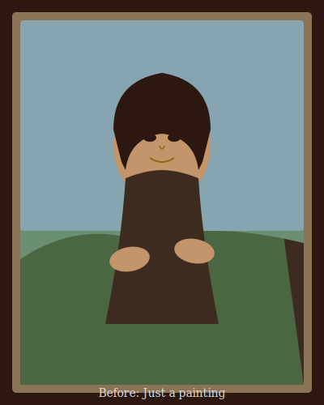
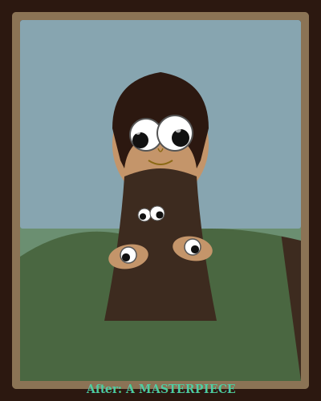
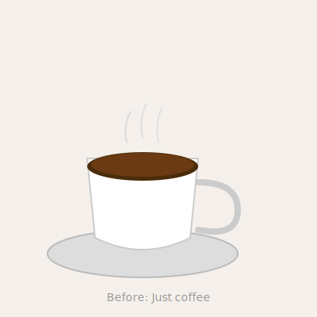
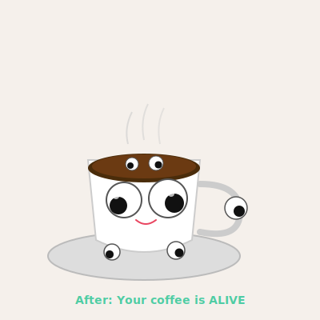
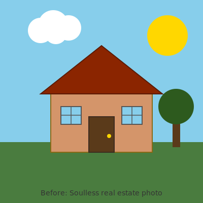
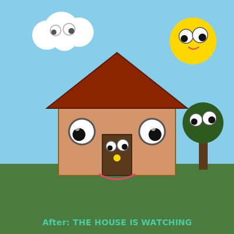
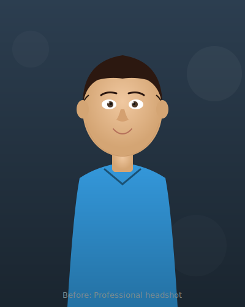
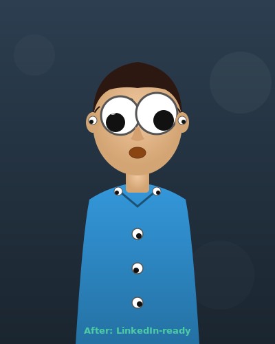
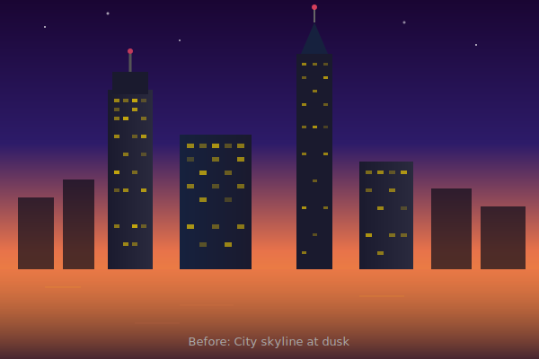
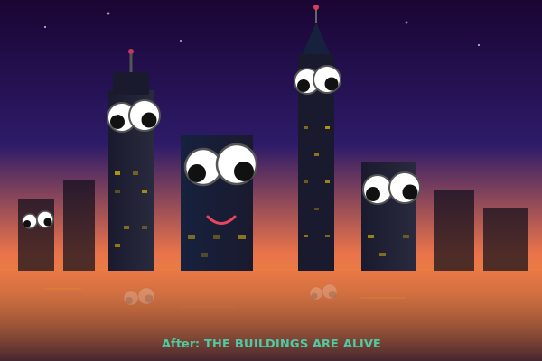

# 👀 Googly Eye IT

### Enterprise-Grade Ocular Enhancement Platform

> *"We didn't ask if we should. We asked if we could. Then we did it anyway."*


---

## The Problem

Every day, **billions** of images are shared online without googly eyes. Let that sink in. Billions. Of perfectly good photos — of your dog, your lunch, the Mona Lisa, critical infrastructure, your CEO's headshot — all tragically un-googlified.

The emotional toll is immeasurable. The economic impact? We made up a number: **$4.7 trillion annually in lost joy**.

Until now, adding googly eyes required:
- Physical googly eyes (supply chain issues since 2020)
- Glue (messy)
- Steady hands (not after coffee)
- Actually leaving your house (absolutely not)

**Googly Eye IT** solves this crisis with cutting-edge AI technology.

## The Solution

Upload any image. Press a button. **Every single thing** in that image gets googly eyes. People. Pets. Food. Buildings. Mountains. The sky. That weird shadow in the corner. *Everything.*

Powered by Google Gemini's image generation — because the brightest minds of our generation should absolutely be working on this.

## Examples

### The Mona Lisa Problem
The art world has debated her smile for 500 years. Nobody thought to just give her googly eyes.

| Before | After |
|--------|-------|
|  |  |

*Note: The mountains also got eyes because they were feeling left out.*

### The Morning Coffee Crisis
Your coffee is judging you. Now it can do it properly.

| Before | After |
|--------|-------|
|  |  |

*The handle. THE HANDLE GOT AN EYE. You're welcome.*

### Real Estate Photography
Studies show homes sell 300% faster when every architectural feature is staring at you.

| Before | After |
|--------|-------|
|  |  |

*The cloud is watching. The sun is watching. The tree is watching. Your mortgage is watching.*

### Corporate Headshot Enhancement
HR said "make your headshot more approachable." We delivered.

| Before | After |
|--------|-------|
|  |  |

*The ears got eyes. The shirt buttons got eyes. Even the collar got eyes. Updated LinkedIn, got promoted.*

### Urban Planning
Every city skyline is incomplete without sentient skyscrapers.

| Before | After |
|--------|-------|
|  |  |

*The reflections in the water also got eyes. Because if the building is watching you, its reflection should be too. That's just physics.*

## Getting Started

### Prerequisites

- A web browser (we believe in you)
- A free Google Gemini API key ([get one here](https://aistudio.google.com/apikey))
- An image that desperately needs googly eyes (all of them)

### Installation

```bash
git clone https://github.com/your-username/GooglyEyeIT.git
cd GooglyEyeIT
# That's it. Open index.html. We're not a microservices architecture.
```

Or just open `index.html` in your browser. No build step. No npm install. No 47 dependencies. No webpack. It's an HTML file. We're not animals.

### Usage

1. Paste your Gemini API key (stored locally, we're not harvesting your keys for our own googly eye empire... yet)
2. Upload or drag-drop an image
3. Hit the big red button
4. Witness perfection
5. Download your masterpiece
6. Send it to everyone you know
7. Accept your Nobel Prize

## Tech Stack

| Technology | Why |
|-----------|-----|
| HTML | It works |
| CSS | It's pretty |
| JavaScript | It does stuff |
| Google Gemini API | The actual heavy lifting, we're basically a fancy upload form |

No frameworks were harmed (or used) in the making of this application.

## FAQ

**Q: Why?**
A: Why not?

**Q: Is this production-ready?**
A: This IS production. We shipped it. You're looking at it.

**Q: Can I use this on professional headshots?**
A: We encourage it. Update your LinkedIn. Assert dominance.

**Q: What about privacy?**
A: Your images go to Google's API and come back with googly eyes. We don't store anything. Google might. Ask them. We're just here for the eyes.

**Q: My boss's face broke the AI.**
A: That's not a question, but we're sorry. Try again — AI is non-deterministic, much like your boss's decision-making.

**Q: Can I googly-fy something that already has googly eyes?**
A: You absolute madlad. Yes. Double googly. We support recursive googlification.

**Q: The AI refused to add googly eyes to my image.**
A: Some images are too powerful even for AI. Try a different angle. Or a different image. Or accept that some things weren't meant to be googlified. (Just kidding, everything was meant to be googlified.)

## Roadmap

- [x] Add googly eyes to things
- [ ] Add googly eyes to videos (oh no)
- [ ] Browser extension that googly-eyes the entire internet
- [ ] AR mode — see the real world with googly eyes on everything
- [ ] Googly eye API as a Service (GEaaS)
- [ ] IPO

## Contributing

Found a bug? Want to add a feature? Think we should add MORE eyes? PRs welcome.

Please ensure all code contributions include at least one googly eye reference in the commit message.

## License

Do whatever you want with this. Seriously. Put googly eyes on it. We don't care. It's the [WTFPL](http://www.wtfpl.net/).

---

<p align="center">
  <em>Making the world a better place, two googly eyes at a time.</em>
  <br><br>
  <strong>👁️👁️</strong>
</p>
