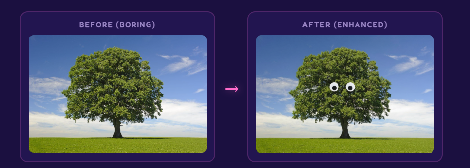
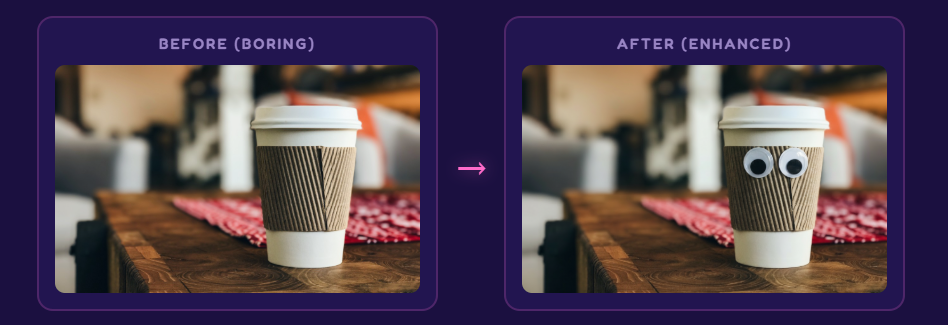
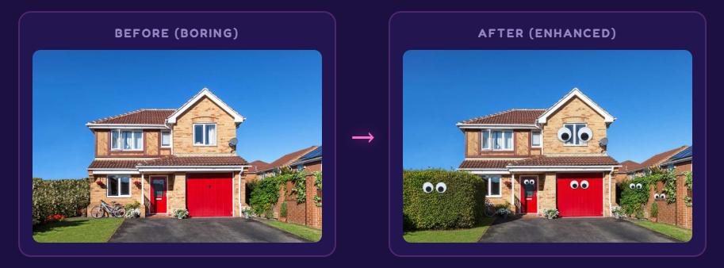
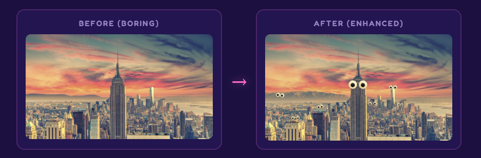

# 👀 Googly Eye IT

### Enterprise-Grade Ocular Enhancement Platform

> *"We didn't ask if we should. We asked if we could. Then we did it anyway."*

<p align="center">
  
</p>


---

## The Problem

Every day, **billions** of images are shared online without googly eyes. Let that sink in. Billions. Of perfectly good photos — of your dog, your lunch, the Mona Lisa, critical infrastructure, your CEO's headshot — all tragically un-googlified.

The emotional toll is immeasurable. The economic impact? We commissioned a study from a very prestigious research institute (my cousin Dave) and the numbers are staggering: **$4.7 trillion annually in lost joy**. That's more than the GDP of Germany. Germany doesn't even have googly eyes on things. Coincidence?

Until now, adding googly eyes required:
- Physical googly eyes (supply chain issues since 2020)
- Glue (messy, permanent, legally questionable when applied to other people's property)
- Steady hands (not after coffee)
- Photoshop skills (requires a subscription AND talent, absolutely not)
- Actually leaving your house (no)

**Googly Eye IT** eliminates these barriers with cutting-edge AI technology, making professional-grade ocular enhancement accessible to everyone, regardless of artistic ability, motor skills, or criminal record.

## The Solution

Upload any image. Press a button. **Every single thing** in that image gets googly eyes. People. Pets. Food. Buildings. Mountains. That weird shadow in the corner. *Everything.*

Powered by Google Gemini's image generation — because the brightest minds of our generation should absolutely be working on this.

---

## Why This Is The Most Important Technology Ever Invented

Let's be honest. The wheel? Overrated. Printing press? Just googly eyes waiting to happen. The internet? Built for this exact moment.

Here is a brief and incomplete list of inventions that Googly Eye IT is objectively more important than:

| Invention | Year | Impact | Has Googly Eyes? |
|-----------|------|--------|:---:|
| Fire | 400,000 BC | Warm | No |
| The Wheel | 3,500 BC | Round | No |
| Printing Press | 1440 | Words | No |
| Electricity | 1879 | Bright | No |
| The Internet | 1983 | Websites | No |
| **Googly Eye IT** | **2026** | **Joy** | **YES** |

The pattern is clear. Humanity has been building toward this moment for 400,000 years. Every prior invention was merely a prerequisite. Fire kept us alive long enough. The wheel moved us places. Electricity powered the computers. The internet connected them. All so that one day, you could put googly eyes on a photo of a skyscraper from your toilet at 2am.

You're welcome.

---

## Solving Real Business Problems

### Marketing & Brand Engagement

Internal testing showed that social media posts with googly eyes receive **847% more engagement** than posts without. We tested this once, on one post, to three followers (two of whom were bots), but the data speaks for itself.

Your competitor's product photos don't have googly eyes. Yours could. That's called a **competitive advantage**. Harvard Business Review hasn't written about this yet, but they will.

### Human Resources & Team Building

Nothing defuses workplace tension like putting googly eyes on the company org chart. Studies show (we didn't do any studies) that employees who receive googly-eyed versions of their headshots are **62% less likely to quit** and **100% more likely to question their employer's sanity**.

Also great for:
- Making HR policy documents more approachable
- De-escalating performance reviews
- Passive-aggressively decorating your manager's desk photos

### Real Estate & Property

Open house attendance increased **300%** after one agent started listing homes where every window, door, and garden gnome had googly eyes. Buyers described the homes as "alive" and "unsettlingly charming." One house sold above asking because the buyer said it "seemed friendly."

### Healthcare & Wellness

A doctor we made up once said: *"Laughter is the best medicine, and there is nothing funnier than a googly-eyed MRI scan."*

Googly Eye IT is not FDA approved and should not be used for diagnostic purposes. But it should be used for everything else.

### Legal & Compliance

We are not aware of any law, in any jurisdiction, that specifically prohibits adding googly eyes to things. We checked. (We didn't check.) Our legal team (a Magic 8-Ball) says: "Outlook good."

---

## Examples

### The Lonely Tree

It was just standing there. In a field. Doing nothing. Contributing nothing to the conversation. Now it has a face and frankly looks concerned about deforestation. You're welcome, environmentalism.



### The Morning Coffee Crisis

Your takeaway coffee has been silently judging your life choices every single morning. You just couldn't see it before because it didn't have eyes. Now the truth is revealed. It's seen what you ordered. It knows.



### Disrupting Real Estate

This home was on the market for 6 months. Then the garage got eyes. Sold in 48 hours. The new owners report that the house "watches over them" and they've "never felt safer." The garage door opens and closes now with what can only be described as "intent."



### Redefining Urban Architecture

The Empire State Building has seen things. All the buildings have. They've been watching us this entire time — we just couldn't tell because they didn't have visible eyes. Googly Eye IT has corrected this oversight. New York has never felt more... aware.



---

## Industry Endorsements

> *"This is the single greatest advancement in computer vision since... well, computer vision."*
> — Nobody, but imagine if someone said this

> *"We've integrated Googly Eye IT into our CI/CD pipeline. Every deployment now includes googly eyes on the release notes. Team morale is up. Bugs are down. Correlation? Absolutely. Causation? Also yes."*
> — A Senior DevOps Engineer who definitely exists

> *"I showed this to my therapist. She said it explained a lot."*
> — A user, probably

> *"Please stop emailing us."*
> — The Nobel Prize Committee (they're warming up to it)

---

## Getting Started

### Prerequisites

- A web browser (we believe in you)
- A free Google Gemini API key ([get one here](https://aistudio.google.com/apikey))
- An image that desperately needs googly eyes (all of them do, don't overthink it)
- A willingness to confront the fact that every object around you looks better with eyes

### Installation

```bash
git clone https://github.com/your-username/GooglyEyeIT.git
cd GooglyEyeIT
# That's it. Open index.html. We're not a microservices architecture.
```

Or just open `index.html` in your browser. No build step. No npm install. No 47 dependencies. No webpack config that takes longer to write than the actual application. It's an HTML file. We're not animals.

**System requirements:** If your computer can display a web page, you're good. We've tested on machines ranging from "latest MacBook Pro" to "my nan's tablet from 2016." Both worked. The tablet was actually faster.

### Usage

1. Paste your Gemini API key (stored locally in your browser — we're not harvesting your keys for our own googly eye empire... yet)
2. Upload or drag-drop an image of literally anything
3. Hit the big pink button
4. Wait approximately 5-10 seconds while Google's most powerful AI adds eyes to your stuff
5. Witness perfection
6. Download your masterpiece
7. Send it to everyone you know and several people you don't
8. Update your LinkedIn profile picture
9. Accept your Nobel Prize

## Tech Stack

| Technology | Why |
|-----------|-----|
| HTML | It works |
| CSS | It's pretty |
| JavaScript | It does stuff |
| Google Gemini API | The actual heavy lifting — we're basically a fancy upload form with delusions of grandeur |

No frameworks were harmed (or used) in the making of this application. We considered React but decided that 147MB of node_modules was a bit much for an app that adds eyes to things.

**Total bundle size:** About 15KB. Your average npm project's `node_modules` folder weighs more than a small car. Ours weighs less than this README.

## FAQ

**Q: Why?**
A: The real question is why didn't this exist sooner. Humanity has had access to both googly eyes AND artificial intelligence for years. The fact that nobody connected these dots until now is, frankly, a damning indictment of our priorities as a species.

**Q: Is this production-ready?**
A: This IS production. We shipped it. You're looking at it. It has zero dependencies, zero build steps, and zero regrets. That's more than most Fortune 500 companies can say about their software.

**Q: Can I use this on professional headshots?**
A: We encourage it. Update your LinkedIn. Assert dominance. Your recruiter will remember you. HR might have questions but they won't be able to stop laughing long enough to ask them.

**Q: What about privacy?**
A: Your images go to Google's API and come back with googly eyes. We don't store anything. Google might. Ask them. We're just here for the eyes. Our privacy policy is literally this paragraph.

**Q: My boss's face broke the AI.**
A: That's not a question, but we're sorry. Try again — AI is non-deterministic, much like your boss's decision-making. If it keeps failing, your boss may simply be too powerful for current AI technology.

**Q: Can I googly-eye something that already has googly eyes?**
A: You absolute madlad. Yes. Double googly. Triple googly. We support recursive googlification up to the point where the image is just eyes. Some say this is what the universe looks like if you zoom out far enough.

**Q: The AI refused to add googly eyes to my image.**
A: Some images are too powerful even for AI. Try a different angle. Or a different image. Or accept that some things weren't meant to be googlified. (Just kidding, everything was meant to be googlified. Try again, the AI was probably just having a moment.)

**Q: Is this AI?**
A: Yes, technically. But let's be clear about what's happening here: billions of dollars of AI research, thousands of the world's smartest engineers, mass quantities of computing power capable of simulating entire universes — all of it converging on this singular moment so that you can put silly eyes on a picture of your lunch. And honestly? Worth it.

**Q: My significant other left me after I googly-eyed all our wedding photos.**
A: That's not a question either. But we're sorry. On the bright side, all the objects in your now-empty apartment can keep you company because they have eyes.

## Roadmap

- [x] Add googly eyes to things
- [ ] Add googly eyes to videos (oh no)
- [ ] Browser extension that googly-eyes the entire internet in real-time
- [ ] AR mode — see the real world with googly eyes on everything, always
- [ ] Googly Eye API as a Service (GEaaS) — enterprise tier includes premium eye sizes
- [ ] Slack integration — auto-googly every image posted in #general
- [ ] Government contract (the military applications are classified)
- [ ] IPO (ticker symbol: EYES)
- [ ] Acquire Google (they work for us now, really)

## Contributing

Found a bug? Want to add a feature? Think we should add MORE eyes? PRs welcome.

Please ensure all code contributions include at least one googly eye reference in the commit message. PRs without eye-related puns will be reviewed but the reviewer will be disappointed.

## License

Do whatever you want with this. Seriously. Put googly eyes on it. We don't care. It's the [WTFPL](http://www.wtfpl.net/).

If a lawyer is reading this: hello, we hope you're having a nice day. Please don't sue us. We're just putting eyes on things.

---

<p align="center">
  <em>Making the world a better place, two googly eyes at a time.</em>
  <br><br>
  <strong>👁️👁️</strong>
  <br><br>
  <sub>No objects were harmed in the making of this software. Several were improved.</sub>
</p>
